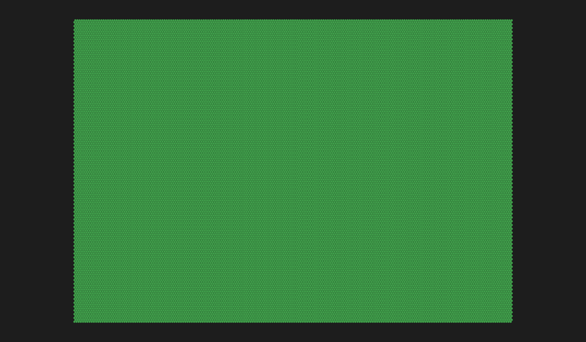

# Hextergen

Hextergen is a project that I started for fun to learn Rust. It's focused on exploring the most optimized ways (what I found from my personal research) to work with data structures and parallelism. On top of that, my aim is to create a visually appealing map generator that pays homage to our planet.

## Mesh

I need a 2D mesh to represent areas in the map, requiring me to choose a shape representing each area. After some research, I found out that hexagons are the most naturally occurring shape [due to minimizing the surface energy](https://www.researchgate.net/publication/359078833_The_Tendency_of_Nature_towards_Hexagon_Shape_Formation_due_to_Minimizing_Surface_Energy) and made them the ultimate winner for the project.
It's also worth mentioning that most of the hexagon meshes in code out there are based on the [brilliant blog research made by RedBlobGames](https://www.redblobgames.com/grids/hexagons/implementation.html), so I'm basing all the hex relation (not the mesh) in the Rust library [hexx](https://github.com/ManevilleF/hexx). This library will help me understand the position of a hex in the mesh and on the screen (pixel for centres and corners).

Because the width and height of the mesh will be known when the code runs, the most optimal way to store the mesh data is on an [ndarray](https://github.com/rust-ndarray/ndarray)

<!-- Add the reference to the benchmarks -->

## Topography

The topographic aspect of the generation defines the elevation of the terrain. To make the terrain more interesting, [OpenSimplex 2D noise](https://docs.rs/noise/latest/noise/struct.OpenSimplex.html) is applied through an [octave function](https://observablehq.com/@saneef/noise-octaves) for texturing, is combined with a tectonic plates simulation for more visually appealing mountain ranges or ocean rifts.
Since the map is wrapping around the width, the mesh's $x:y$ coordinates are transformed to cylindrical.

### Tectonic Plates

The tectonic plates simulation is a multi-step process that goes as follows:

**1. Seed Placement**

The seed represents the origin of the tectonic plates. From here, they will grow until all hexes in the mesh are assigned to a plate. Each plate is identified by its seed.
I first tried seed placement with [Poisson Disk sampling](https://sighack.com/post/poisson-disk-sampling-bridsons-algorithm), but the results were too uniform for my liking. So, I decided to create a simple function that randomly picks hexes on the mesh, making sure there is a minimum distance between them. This way, I can better control how many places I want to generate.

<table>
  <tr>
    <th>Custom Seed Placement</th>
    <th>Poisson Disk Sampling</th>
  </tr>
  <tr>
    <td></td>
    <td></td>
</table>

**2. Plates Growth**

The growth algorithm expands each seed into a fully-fledged tectonic plate using [breadth-first search](https://en.wikipedia.org/wiki/Breadth-first_search), but items are put in a FIRO (First In Random Out) queue. This way, the plate will grow in a more organic way. This step will also define the plate's movement expressed by an angle $0^\circ \leq \angle \theta < 360^\circ$ and a magnitude $m$ that equals the total hexes in the plate.

**3. Plates Borders**

To understand the resulting interaction each plate has with its surroundings, I need to identify each plate's borders. This is done by going through all the hexes in the plate and checking if any of its neighbours are not part of the plate. If so, the hex is added to the border list.
As mentioned before, the map wraps around the witdh, so the $- 1:-1$ identify the top and bottom borders of the map.

Because, at this point, the direction $\angle\theta$ and magnitude $m$ of the plates are known, I can categorize the interaction. The plates can be classified as:

- **Divergent**: When the plate moves away from the mesh's centre.
- **Convergent**: When the plate moves towards the mesh's centre.

<table>
  <tr>
    <th>Process</th>
    <th>Visualization</th>
  </tr>
  <tr>
    <td>Identify the angle relation between the two plates' seeds</td>
    <td></td>
  </tr>
  <tr>
    <td>Rectify the direction angle by the relation between the plates</td>
    <td></td>
  </tr>
</table>

With the rectified directions, we can now classify the interaction with the following rules:

| **A**         | **B**         | **Interaction**                                                |
| ------------- | ------------- | -------------------------------------------------------------- |
| $\rightarrow$ | $\leftarrow$  | Convergent                                                     |
| $\leftarrow$  | $\rightarrow$ | Divergent                                                      |
| $\rightarrow$ | $\rightarrow$ | $\text{If } A_m > B_m \text{ then Convergent; else Divergent}$ |
| $\leftarrow$  | $\leftarrow$  | $\text{If } A_m > B_m \text{ then Divergent; else Convergent}$ |

Where $A_m$ and $B_m$ are the magnitudes of the plates $A$ and $B$ respectively.

Here, you can see the $Convergent$ interactions in yellow and the $Divergent$ interactions in blue.

> **Note**: The real tectonic plates interaction is way more complex and depends in multiple factors such as the type of plate (oceanic or continental), the density of the plates, the temperature of the mantle, etc. This is a simplified version for the sake of the project.

**4. Slopes**

The slopes represent how the interactions affect the terrain. They are an array of hexes that go from a plate's hex border to its seed. They are defined by an [A* algorithm](https://en.wikipedia.org/wiki/A*_search_algorithm) weighted by the distance to the seed. To make the slopes more natural-looking, I'm randomizing the order of hexes neighbors that are the _next_ candidate for the algorithm to check.

<table>
  <tr>
    <th><b><i>i₁</i></b></th>
    <th><b><i>i₂</i></b></th>
    <th><b><i>i₃</i></b></th>
    <th><b><i>i₄</i></b></th>
    <th><b><i>iₙ</i></b></th>
  </tr>
  <tr>
    <td></td>
    <td></td>
    <td></td>
    <td></td>
    <td></td>
  </tr>
</table>

**5. Elevation**

Now that the slopes are defined, I can apply the elevation effect to the terrain. Each type of interaction has a different formula to mutate the elevation of the hexes. The formulas are based on:

$E = (E_i + (D_e \times S)) \times C$

- $E$: Resulting elevation
- $E_i$: Initial elevation
- $D_e$: Distance effect
- $S$: Strenght of the effect
- $C$: Coefficient
- **Convergent**: $D_e = 0.01 + \frac{i}{n}$
- **Divergent**: $D_e = -0.01 - \frac{i}{n}$

In this formula, $i$ represents the hex index within the slope, $n$ the total number of hexes from the seed to the border, making $\frac{i}{n}$ a normalized distance. The $S$ strength of the effect controls the amplitude of the elevation change. Meanwhile, the $C$ coefficient controls the overall elevation of the terrain.

<table>
  <tr>
    <th>Before</th>
    <th>After</th>
  </tr>
  <tr>
    <td></td>
    <td></td>
  </tr>
  <tr>
    <td></td>
    <td></td>
  </tr>
</table>

## Rendering

In the rendering, I transform all the terrain data into images. This is done concurrently by splitting the image into four quadrants. Each quadrant calculates the required displacement for the pixels on that section of the mesh to represent it properly.
