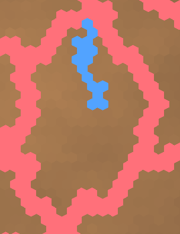
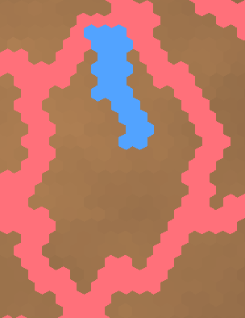
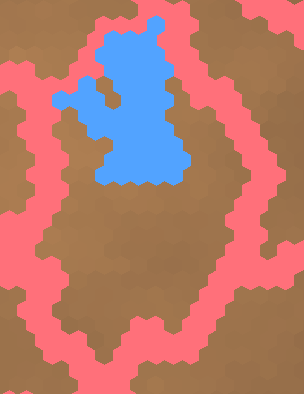
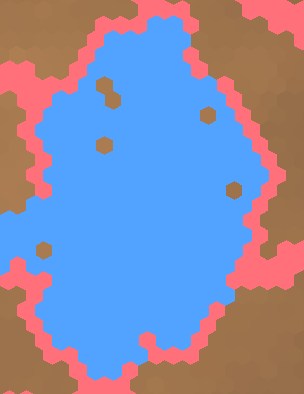
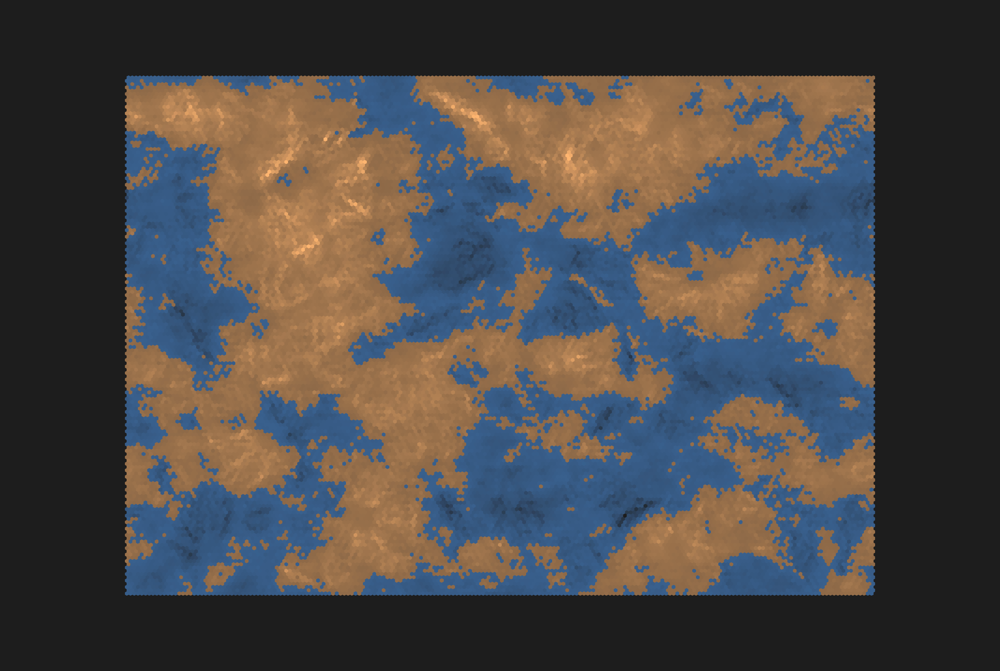
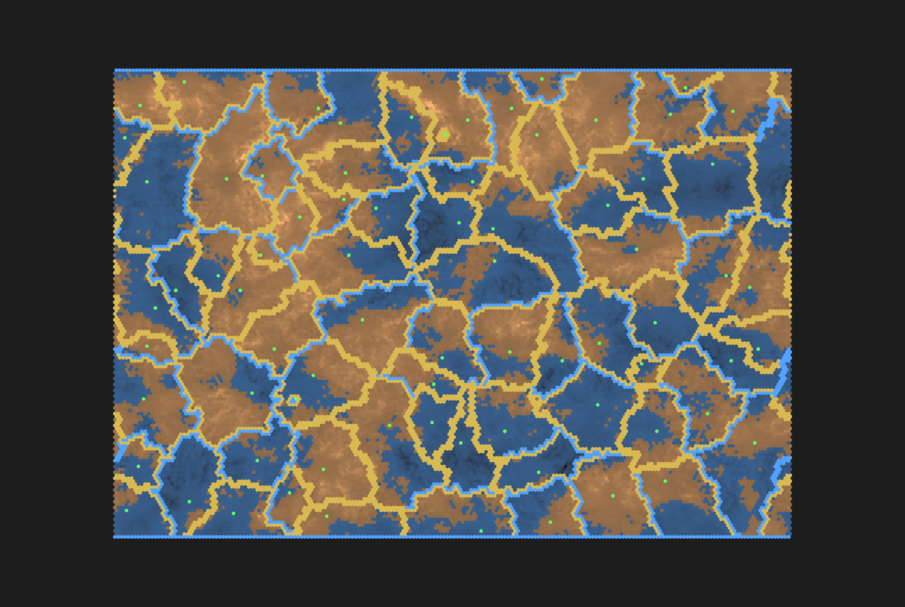

# Simulation Documentation

## Overview

This document outlines the procedural map generation simulation process, which culminates in the creation of a two-dimensional image rendered as a mesh composed of hexagonal tiles. Each hexagonal tile's color corresponds to a terrain type, informed by various factors computed during the simulation and derived from a predefined color palette.

## Mesh Structure

The mesh constitutes the foundational geometric representation of the terrain. I leverage a two-dimensional array (ndarray) for efficient storage and rapid access of hexagonal data. The `get` method facilitates type conversions and access to hex attributes.

The mesh also encapsulates pixel information for each hex, including displacement vectors and resolution parameters. These details are essential for precise positioning of hexes on the rendering canvas, ensuring that the final image is a true representation of the simulated world.

## Topography

The topographic aspect of the simulation determines the elevations and hydrography of the terrain. Initially, a noise algorithm provided by the OpenSimplex library generates a base texture for elevation, it's made more interesting by applying octaves to the noise calculation. However, to introduce more complexity and natural features, I implement additional processes to simulate tectonic plate movement and interaction.

For the noise coordenates, I'm converting the offset `x` and `y` to a cilindrical projection. This way the left and right side of the map are continuous.

The topography shape is influenced by a tectonic plates simulation, which is divided into five key steps:

### 1. Seed Placement

The map's initiation begins with the strategic placement of seed points that act as identifiers for individual tectonic plates. I initially wanted to use a Poisson Disk approach, but the result were too uniform for my taste, so I ended upp creating a simple logic that picks the seeds randomly ensuring aminimum distance between the points.

| **Custom Distribution**                      | **Poisson Distribution**                       |
| -------------------------------------------- | ---------------------------------------------- |
|  |  |

### 2. Plate Growth

The growth algorithm expands each seed into a full-fledged tectonic plate using a breadth-first search mechanism. This expansion is facilitated by a specially designed random queue to model natural geological progression and form distinct tectonic plates on the map. In this step, plates are also assigned a direction for the movement, which is just an random angle from $0º$ to $360º$.

### 3. Plate Borders

To understand the relation between the plates and how they interact, we need to define their borders. This is done by going through all hexes in a plate's area and identifying if the neighbors of the hex are from the same plate or not. If they are not, we add the hex to the border list. The plates on the top and bottom edges of the map have a special edge border identifyed by the coordinate `(-1,-1)` and they are always Divergent.

To understand the interaction between the plates, we check the relative plate's direction between the neighbors.

> **Note**: There are a lot of interaction types for tectonic plates in the real world. They depend on the plate varian (Continental or Oceanic), direction of movement, compression rate.
> But for this simulation, I'm only focusing on interactions that bring visual apeal to the map.

| **Visualization**                                              | **Description**                                                                                                            |
| -------------------------------------------------------------- | -------------------------------------------------------------------------------------------------------------------------- |
|                | Identify the delta between $0º$ and the angle between the plates' seeds.                                                   |
|  | We rotate the angle between to become our new $0º$, which help us to understand the relative direction between the plates. |

There are four type of interactions we can expect with this simulation:
| **Directions**                   | **Interaction**                                        |
| -------------------------------- | ------------------------------------------------------ |
| ${\rightarrow} \| {\leftarrow}$  | ${\text{Convergent}}$                                  |
| ${\leftarrow}  \| {\rightarrow}$ | ${\text{Divergent}}$                                   |
| ${\rightarrow} \| {\rightarrow}$ | $A_m > B_m ? {\text{Convergent}} : {\text{Divergent}}$ |
| ${\leftarrow}  \| {\leftarrow}$  | $B_m > A_m ? {\text{Convergent}} : {\text{Divergent}}$ |

Where $A_m$ and $B_m$ are the magnitude (total hexes in area) of the plates.

### 4. Slopes

The slopes are a list of arrays that go from the border hex of a plate to its seed. These array will affect the elevation of the hexes in the map.
The slopes are defined by an A* algorithm that goes from the seed of the hex to the border. The cost of moving from one hex to another is defined by the difference in distance between each and the border.

| $i_I$                     | $i_{II}$                    | $i_{III}$                     | $i_{IV}$                    | $i_{n}$                   |
| ------------------------- | --------------------------- | ----------------------------- | --------------------------- | ------------------------- |
|  |  |  |  |  |

### 5. Elevation

After the initial elevation assignation via the noise algorithm, we apply the slope to the map. The slope will affect the elevation of the hexes in the map. The elevation is adjusted linearly with distance from the seed to the border, subtly at first and then more pronouncedly, with a baseline adjustment to ensure even the first step away from the seed has a minimal effect.

For each hex along a slope:
- **Convergent Interaction**: The elevation increases away from the seed. This interaction simulates the effect of tectonic plates moving towards each other, causing terrain to uplift. The elevation change is determined linearly with distance from the seed to the border, subtly at first and then more pronouncedly, with a baseline adjustment to ensure even the first step away from the seed has a minimal effect.
  
  The formula for adjusting elevation is as follows:

  $$
  \text{elevation}_{\text{new}} = (\text{elevation} + (\text{distance\_effect} \times \text{effect\_strength})) \times 1.03
  $$

  where $\text{distance\_effect} = 0.01 + \frac{i}{n}$ for convergent interactions.
  
- **Divergent Interaction**: The elevation decreases away from the seed. This interaction simulates the effect of tectonic plates moving apart from each other, leading to a decrease in terrain elevation. Similar to convergent interactions, the change starts minimally and becomes more significant towards the border.
  
  For divergent interactions, the formula is adjusted to account for the negative direction of change:

  $$
  \text{elevation}_{\text{new}} = (\text{elevation} + (\text{distance\_effect} \times \text{effect\_strength})) \times 1.03
  $$

  where $\text{distance\_effect} = -0.01 - \frac{i}{n}$ for divergent interactions.

In these formulas, $i$ represents the hex index within the slope, $n$ the total number of hexes from the seed to the border (making $\frac{i}{n}$ a normalized distance), and $\text{effect\_strength}$ controls the magnitude of elevation adjustment. The final multiplication by $1.03$ slightly amplifies the adjusted elevation, ensuring the transformation is perceptible across the terrain.

This method allows elevation to dynamically reflect the geological processes at play, with the $effect\_strength$ parameter offering control over the degree to which these processes impact the landscape.

| **Before**                            | **After**                                     |
| ------------------------------------- | --------------------------------------------- |
|  |  |

You can see here the tectonic interactions and how they affect the elevation of the map. In `yellow` we have the Convergent interactions and in `blue` the Divergent interactions.

## Rendering

Rendering is the final phase, transforming simulation data into a visual representation. It involves converting mesh information into image coordinates and drawing hexes and terrain features.

To manage the demands of large image sizes, the rendering process is divided into quadrants. Each quadrant is processed in parallel, yielding a performance increase of over 300%.

*Note: The following quadrant images are for debugging purposes and illustrate the segmented rendering approach.*

- **Top Left Quadrant**
  
  

- **Top Right Quadrant**
  
  

- **Bottom Left Quadrant**
  
  

- **Bottom Right Quadrant**
  
  
